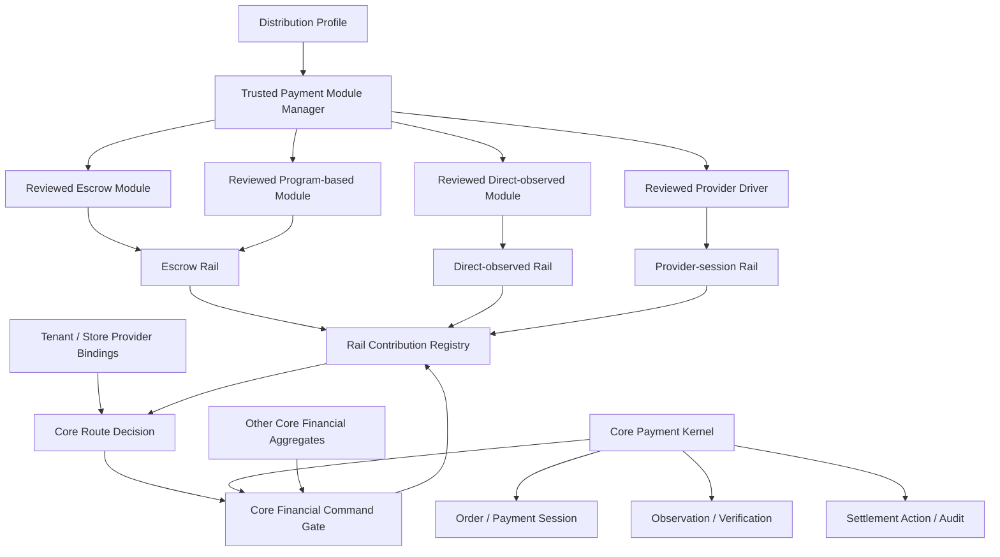

# RFC-0006: Payment Kernel, Rails, and Trusted Distribution Modules

- Status: Draft
- Authors: Mobazha architecture and payment maintainers
- Created: 2026-07-05
- Updated: 2026-07-11
- Decision owners: Mobazha Open Core, distribution, and payment maintainers
- Affected surfaces: Node, distributions, payment rails, hosted service, clients, docs
- Supersedes: None
- Superseded by: None

## Summary

Define the payment-domain architecture as one Core-owned payment kernel,
multiple typed payment rail families, one lifecycle manager for reviewed
first-party payment modules, and explicit distribution profiles that select
which modules may be composed.

The payment kernel owns payment intents and sessions, their binding to
Core-owned orders, normalized observations, verification, settlement commands,
recovery, and audit. A payment module owns protocol- or provider-specific
integration and contributes one or more rail implementations through narrow
public contracts. The trusted module manager validates identity, dependencies,
authority, activation policy, registration, readiness, health, failure
isolation, shutdown, and rollback. A distribution profile selects modules and
policy before the Node opens resources; it does not create another Node or
another payment state machine.

This RFC specializes the domain-manager model in
[RFC-0002](./0002-composable-extension-platform.md). It does not propose one
universal manager for every extension domain, and it does not claim that every
rail, durable route, profile gate, or third-party runtime described below is
implemented.

[RFC-0008](./0008-node-key-domains-and-receiving-architecture.md) separately
governs wallet accounts, receiving destinations, key domains, and opaque
signers. Its Wallet Adapter Registry is an evolution of wallet infrastructure;
it is not this RFC's Payment Rail Contribution Registry and does not select or
authorize order settlement routes.

[RFC-0009](./0009-frozen-payment-attempt-settlement-terms.md) separately
governs the economic terms that bind to a payment attempt before its funding
target becomes actionable. Rail contributions execute the resulting commands;
they do not own or recompute those terms.

## Problem and evidence

Payment integrations differ in real protocol semantics:

- an escrow rail locks funds and may support confirm, cancel, refund, complete,
  or dispute release;
- a direct-observed rail detects payment to a receiving target and may have no
  escrow settlement operation;
- a provider-session rail creates an external session, validates callbacks,
  and reconciles provider state.

Forcing these integrations through one large escrow interface produces
unsupported methods, weakens capability checks, and obscures which component
owns settlement authority. Treating each integration as an independent
payment subsystem is worse: order binding, amount validation, idempotency,
recovery, and audit drift across implementations.

Open Core now has public payment rail kinds, least-privilege runtime grants,
reviewed in-process payment modules, dependency-ordered lifecycle management,
setup-gated status, per-module contribution ownership, reverse cleanup, and
failure isolation. It also retains built-in payment and provider registries.
The implemented pieces establish the direction but do not yet provide a
complete durable routing and upgrade contract for every rail family.

The missing public model creates several risks:

- a distribution may confuse source presence with an enabled capability;
- a module failure may disable unrelated rails if contribution ownership is
  not explicit;
- a new payment method may bypass Core verification or settlement commands;
- a module upgrade may strand an in-flight payment if its implementation
  identity and protocol binding are not durable;
- wallet, deployment, or provider administration may leak into the payment
  rail interface merely because one package owns both;
- a future third-party process may be mistaken for a trusted static module or
  be granted in-process authority.

## Proposal

### 1. Adopt the payment-domain model



The arrows are authority-limited contracts, not unrestricted service access.
The module manager governs reviewed first-party payment implementations. The
payment kernel governs payment state. Other Core financial aggregates retain
their own state machines and may use an explicitly compatible rail capability
through the same Core command gate; they do not become Payment Sessions. A
rail contribution describes external payment semantics. A provider binding
describes tenant- or store-scoped configuration. A distribution profile
describes composition policy. These are different roles and must remain
different types.

This separation aligns with [RFC-0005](./0005-core-owned-resource-collateral.md):
the collateral aggregate may request supported external funding, release, or
slash execution, but the payment kernel never absorbs collateral state and an
order settlement record never stands in for collateral.

The manager is payment-domain infrastructure. It is not the universal module
manager rejected by RFC-0002, an artifact marketplace, a package installer, or
an untrusted-code sandbox.

### 2. Keep the Core payment kernel authoritative

The Core payment kernel owns:

- order and tenant binding;
- canonical chain, network, asset, amount, destination, and expiry validation;
- payment intent and payment session state;
- funding target and normalized observation records;
- verification and confirmation policy;
- refund, dispute, and settlement command admission;
- durable settlement action status and reconciliation intent;
- expected revisions, idempotency, replay protection, and audit;
- key custody and approval of typed signing requests;
- effective capability projection to clients and Agents.

No module may mark an order paid, mutate a payment session, authorize a
release, write Core tables, or choose an unvalidated payout destination. A
module may return a setup result, observation, transaction result, provider
status, or attestation. Core validates that input and decides whether to issue
a Core-owned command.

The kernel normalizes the facts needed by commerce without copying an entire
chain SDK or provider object into Core state. Protocol-private operational
state remains owned by the module or external provider.

### 3. Model rail families by semantics

Rail kind is independent from module identity, chain identity, asset identity,
runtime, and distribution. A module may contribute more than one network or
asset, but every contribution declares its rail semantics and exact
capabilities.

Payment classification remains orthogonal:

| Dimension | Meaning | Examples |
|---|---|---|
| Rail kind | External funding, custody, and settlement semantics | escrow, direct-observed, provider-session |
| Funding mode | How a payer satisfies a session | address-monitored, provider checkout, wallet action |
| Product mode | Order refund, dispute, and release policy | cancelable, moderated |
| Runtime | Where the implementation executes | reviewed static module, isolated process, remote provider |
| Provider binding | Which tenant/store configuration serves the work | versioned account and credential reference |

One value never implies another. An escrow rail can use address-monitored
funding; a direct-observed rail can use the same payer experience without
gaining escrow actions. Clients consume Payment Session funding and product
semantics, not internal module IDs or rail kinds.

#### Escrow rail

An escrow rail may provide a subset of:

- payment setup and deterministic funding target derivation;
- deposit observation and verification;
- confirm, cancel, refund, complete, and dispute release;
- fee estimation and action status;
- typed transaction construction and signing requests;
- reconciliation of prepared, submitted, confirmed, failed, or ambiguous
  external actions.

Support for one escrow action does not imply support for all actions. Core
must reject a payment or policy whose required settlement operation is absent.

#### Direct-observed rail

A direct-observed rail may provide:

- receiving target or account allocation;
- durable observation registration and restart recovery;
- confirmation, amount, asset, account, and expiry verification;
- normalized funding observations;
- optional refund or withdrawal operations under a separate capability.

It is not required to implement escrow-only dispute or release operations.
Administrative wallet functions, backup material, balance management, node
selection, or general withdrawal APIs are not part of the checkout rail merely
because the same reviewed package provides them.

#### Provider-session rail

A provider-session rail may provide:

- external session creation;
- signed callback or webhook verification;
- provider status polling and reconciliation;
- confirmation, cancellation, capture, or refund when explicitly supported;
- minimum versioned metadata needed to recover an accepted session.

Provider credentials and provider-specific payloads remain outside generic
order state. Core persists only the identifiers and normalized facts required
for routing, recovery, dispute handling, and audit.

A reviewed provider driver and a provider binding have different lifecycles.
The driver is statically composed code governed by the trusted module manager.
The binding is tenant- or store-scoped configuration governed by a separate
Core-owned registry. Rebinding an account or rotating credentials creates a
new configuration generation; it cannot silently reinterpret an accepted
session. A binding stores an opaque credential reference, never a secret.

### 4. Define the trusted payment module contract

A reviewed first-party payment module declares at least:

```text
PaymentModuleDescriptor {
  stable module identity
  implementation version or generation
  supported payment rail kinds
  stable contribution identities
  supported networks, assets, and operations
  supported protocol versions
  module-state schema version
  requested Core authority capabilities
  trusted-module dependencies
  activation policy
}
```

Descriptor claims are declarations, not authority. The composition root grants
only the public runtime capabilities approved for that descriptor. Modules
import documented public contracts and never import Open Core internal
packages, receive the complete Node, obtain unrestricted database access, or
receive raw seeds and private keys.

A module's private administration surface is separate from its payment rail.
Deployment management, credential rotation, diagnostics, wallet setup, or
operator recovery do not become generic payment operations.

Descriptor validation must prove that requested authority, declared rails,
and committed contributions agree. A module cannot request a direct-observed
runtime while declaring only escrow, register an undeclared network or asset,
or accept durable work without a protocol and state-schema identity. Empty
optional lists are not wildcards.

### 5. Use one lifecycle manager for trusted first-party payment modules

The trusted payment module manager owns this sequence:

1. normalize and validate descriptors;
2. validate stable identities, capabilities, dependencies, and cycles;
3. prepare each module's contribution through an isolated registrar;
4. atomically commit the complete contribution owned by that module;
5. bind reversible Core references without network I/O or business replay;
6. start observers, deployment checks, recovery, and background work;
7. wait for an explicit ready or status report before advertising capability;
8. publish module, rail, network, and asset health projections;
9. isolate runtime failure to the failed module and its declared dependents;
10. stop in reverse dependency order, unbind, and roll back with retryable
    cleanup.

The manager records exact contribution ownership. A failed module cannot
unregister a Core-owned rail or an unrelated healthy module's network. Bind,
start, stop, unbind, and rollback are different lifecycle operations; an
implementation must not erase state required to retry a failed cleanup.

The target registrar commits typed contributions rather than only a chain or
one global runtime:

```text
PaymentRailContribution {
  contribution_id
  module_id
  rail_kind
  network_id
  asset_id
  supported_operations
  protocol_version
  state_schema_version
}
```

`contribution_id` is stable across restarts and unique within the composition.
Core validates the complete conflict key before commit. The module is the
startup, shutdown, and process-failure unit; the contribution is the routing,
health, capability, and admission unit. A module-wide failure disables its
contributions and declared dependents, while a network- or asset-specific
failure may block only the affected contribution. The target model does not
retain a singleton direct-observed binder or treat chain identity as the only
registration key.

Activation policy has three initial forms:

| Policy | Registration or startup failure | Distribution behavior |
|---|---|---|
| Required | Abort composition or stop the Node | The distribution cannot safely serve without the module |
| Optional | Isolate as degraded | Unrelated capabilities may remain available |
| Setup-gated | Keep administration available but payment unavailable | The operator may complete required setup without advertising checkout |

Manager-owned lifecycle states currently include `starting`, `ready`,
`needs_setup`, `degraded`, and `stopped`; the target contract adds `draining`.
Contribution activity and checkout readiness are separate facts: a setup-gated
module may remain active so its setup surface can operate while its payment
capability remains unavailable.

### 6. Make distribution profiles explicit composition policy

A distribution profile selects, before Core resources are opened:

- reviewed payment modules;
- Core API and private administration allowlists;
- resource profile and background workers;
- payment, pricing, and product policy;
- required, optional, and setup-gated activation expectations.

A profile must not create a second Node type, fork order or payment state, use
product build tags as policy, or imply that every linked module is enabled.

The effective capability for new work is contextual:

```text
profile allows module and rail
  ∩ contracts and versions are compatible
  ∩ module is composed and authorized
  ∩ tenant and resource policy allows the operation
  ∩ configuration is valid
  ∩ required health and readiness are satisfied
  ∩ the requested network, asset, and operation are supported
```

The result is allowed or denied with a stable reason. Clients and Agents use
the connected backend's effective capability response; they do not infer
availability from source code, a module identifier, or a distribution name.

Lifecycle state maps to work admission explicitly:

| State | Admit new work | Service existing work | Reconcile |
|---|---|---|---|
| `ready` | Allowed when all contextual gates pass | Allowed | Required when applicable |
| `needs_setup` | Denied | Only when the persisted route remains serviceable | Required when applicable |
| `degraded` | Denied | Allowed only for operations the contribution reports safe | Required |
| `draining` | Denied | Allowed | Required |
| `stopped` | Denied | Only through a retained compatible implementation | Required when recovery remains possible |

`active` means that a contribution remains bound for lifecycle or recovery; it
does not mean that checkout is available. One Core-owned route-decision
contract combines profile, tenant policy, provider binding, configuration,
health, network, asset, operation, and work mode (`admit-new`,
`service-existing`, or `reconcile`).

### 7. Persist routing identity for accepted work

Every accepted payment uses a persistent attempt. Selecting another asset,
provider binding, or contribution creates a new attempt; it never rewrites the
route of an older attempt. Core retains enough immutable identity to route
callbacks, recovery, and settlement after restart or upgrade:

```text
PaymentRouteBinding {
  tenant_id
  payment_session_id
  payment_attempt_id
  contribution_id
  module_id
  implementation_generation
  rail_kind
  network_id
  asset_id
  protocol_version
  state_schema_version
  provider_binding_id?  // provider-session only
}
```

Core owns this binding. Module-private operational state may live elsewhere,
but it must be recoverable or explicitly migratable. A new default module,
rail implementation, provider version, or distribution profile cannot silently
reinterpret an existing payment.

A provider binding has its own immutable identity and configuration generation:

```text
ProviderBinding {
  provider_binding_id
  tenant_id
  store_id?
  driver_contribution_id
  external_account_reference
  credential_reference
  configuration_generation
  state
}
```

Credential material remains in the owning secret store. Updating an account,
credential reference, or provider mode creates a new generation. Existing
attempts retain their original binding until completed, migrated through an
explicit compatible transition, or reconciled to a terminal state.

External effects follow a persistence-first protocol:

1. in one Core transaction, create the payment attempt, immutable route
   binding, and pending command or action with a Core-generated idempotency key;
2. commit before invoking a chain, sidecar, or provider;
3. dispatch the typed command with that idempotency key and exact route;
4. record the external reference, result, and next reconciliation state;
5. after timeout, crash, or ambiguous response, query by the same key or
   external reference instead of creating replacement work implicitly.

Core does not hold a database transaction open across network I/O and does not
assume distributed two-phase commit. A provider or module that cannot offer
idempotent create-or-retrieve and reconciliation cannot accept durable new
work through that operation.

Disabling new admission does not erase existing obligations. The manager and
kernel distinguish:

- `admit-new`: whether a new intent or session may use the route;
- `service-existing`: whether an implementation can continue an accepted
  payment;
- `reconcile`: whether ambiguous external work must still be observed or
  completed.

An upgrade first blocks new work, then drains or migrates compatible work, and
retains a recovery path for unresolved actions. Financial modules are not
hot-swapped in the middle of an operation.

### 8. Keep untrusted third-party plugins outside the trusted manager

Reviewed first-party modules are statically linked by default because shared
release review, low latency, and transactional coordination justify in-process
composition. Independently distributed or untrusted payment extensions follow
the out-of-process boundary in Open Core ADR-015.

A future plugin supervisor owns artifact verification, process isolation,
handshake, protocol negotiation, resource limits, and restart policy. After
those gates pass, an adapter may contribute the same payment-domain rail
semantics to the Core kernel. The external process does not become a trusted
in-process module and does not gain broader authority.

This RFC reserves compatibility with that model but does not require a plugin
catalog, installer, hot reload, or cross-language supervisor before a concrete
third-party integration need exists.

### 9. State the current and target boundaries accurately

| Capability | Status at RFC creation |
|---|---|
| One Core Node and Core-owned order/payment state | Implemented architecture boundary |
| Public rail-kind classification | Implemented slice |
| Trusted descriptor, dependency ordering, scoped grants, per-module atomic registration, lifecycle, status, reverse cleanup, and rollback | Implemented slice for reviewed static modules |
| Contribution registration and health | Transitional chain-keyed escrow registry, module/chain health, and one direct-observed runtime; typed contribution-level registry remains a target |
| Escrow and direct-observed module conformance | Implemented family-specific slices |
| Provider-session integrations | Existing built-in provider path; reviewed driver plus tenant/store ProviderBinding governance remains a target |
| Distribution and tenant capability projection | Implemented slices for tenant-scoped runtime resolution and availability-filtered distribution payment advertisement; one operation-level route decision remains a target |
| Persistent Payment Session attempt and immutable route binding | Payment Session projection exists; durable attempt, contribution, provider-binding, protocol, and state-schema identity remain a target |
| Persistence-first external-effect protocol | Durable settlement actions exist in family-specific slices; uniform create-or-retrieve and reconciliation remain a target |
| Drain, compatible upgrade, and historical implementation routing | Target |
| Out-of-process third-party payment runtime | Architectural contract and future work, not a shipped supervisor |

An RFC status, source file, descriptor, test fixture, or linked implementation
does not itself establish release availability. Tagged release evidence and the
connected backend's effective capability remain authoritative.

## Security, privacy, and abuse analysis

The architecture preserves the following controls:

- capability and authority grants are explicit and least-privilege;
- Core keeps keys and approves typed signing requests after validating chain,
  asset, amount, destination, purpose, order, expiry, and idempotency;
- observations, callbacks, and attestations are untrusted until issuer,
  binding, freshness, replay, confirmation, and policy checks pass;
- unknown descriptors, versions, required capabilities, networks, assets, and
  operations fail closed;
- module failures cannot remove unrelated contributions;
- required-module failure cannot leave the Node serving an unsafe partial
  payment configuration;
- optional and setup-gated failure cannot make an unavailable rail buyer-
  visible;
- cleanup retains enough state to retry unbind and rollback;
- route admission validates immutable attempt, contribution, tenant, provider
  binding, protocol, state schema, network, asset, and operation identity;
- external creation cannot precede the durable attempt and idempotency record,
  preventing an untracked provider session or transaction from becoming the
  only evidence of accepted work;
- secrets and provider credentials do not enter generic descriptors, logs,
  payment sessions, or client capability responses;
- audit records identify tenant, order, module route, rail, action,
  idempotency key, expected revision, reason, and external reference without
  exposing private material.

In-process review is a trust decision, not a claim that modules are harmless.
Every module still receives narrow ports, validates hostile network/provider
input, uses deadlines and bounded concurrency, and passes negative authority
and recovery tests.

## Economic and legal analysis

This RFC defines composition and authority, not fees, exchange rates, custody,
provider economics, refunds, or legal classification. A module or rail
descriptor does not establish availability, endorsement, licensing, or a
guaranteed dispute outcome.

Each concrete payment-provider proposal must separately identify payer,
recipient, fee basis, custody and signing entity, refund and dispute behavior,
data controller, jurisdiction, sanctions or licensing review, and customer
disclosure where applicable.

## Alternatives

- One payment implementation interface for every rail: rejected because it
  forces direct and provider payments to implement meaningless escrow
  operations.
- One independent payment subsystem per module: rejected because it duplicates
  Core financial state, validation, recovery, and audit.
- One universal manager for every extension domain: rejected because payment
  runtime lifecycle differs from order resources, deterministic Functions,
  and external Controllers.
- Run every first-party module out of process: rejected as a default because it
  adds operational failure modes without creating a meaningful trust boundary
  for jointly reviewed and released code.
- Let distributions fork or subclass the Node: rejected because state machines
  and API semantics drift.
- Infer availability from linked code or a profile name: rejected because it
  bypasses configuration, authorization, health, and operation-level gates.
- Build the full third-party catalog now: deferred until an external ecosystem
  requirement justifies the supervisor, protocol, provenance, support, and
  upgrade cost.

## Rollout and rollback

| Stage | Outcome | Exit evidence |
|---|---|---|
| P0 contract audit | Freeze terms, authority boundaries, current/target matrix, and manager invariants | RFC review plus mapping to public interfaces and conformance tests |
| P1 contribution contract | Replace chain-only and singleton registration with typed contribution keys and narrow setup, observation, verification, action, and reconciliation capabilities | Conflict, ownership, partial-health, negative-capability, and no-op elimination tests |
| P2 route decision | Profile, tenant policy, provider binding, configuration, contribution status, network, asset, operation, and work-mode gates produce stable reasons | API contract, client fixtures, and fail-closed admission/service/reconcile tests |
| P3 durable attempts and effects | Persist attempt, contribution, provider binding, protocol, state schema, and pending action before external I/O | Concurrent create, crash, orphan prevention, wrong-route, restart, and ambiguous-result recovery tests |
| P4 provider-session governance | Separate reviewed provider drivers from versioned tenant/store bindings and bring both under explicit health and recovery rules | Callback routing, account rebinding, credential rotation, outage, and reconciliation tests |
| P5 drain and upgrade | Block new work while servicing and reconciling persisted obligations | Crash, rollback, ambiguous-action, and implementation-upgrade drills |
| Deferred external runtime | Adapt one concrete independently distributed plugin without widening Core authority | Protocol compatibility, isolation, signing-policy, resource-limit, and recovery tests |

Rollout is direct during development; no compatibility layer is required for
unreleased internal interfaces. Durable accepted work is different: migration
must preserve its route binding, financial history, and unresolved obligations.

Rollback blocks new admission for the affected module or route, keeps unrelated
rails active, and continues service or reconciliation for persisted work. It
must not rewrite confirmed history, discard submitted actions, or silently move
an accepted payment to a different provider or protocol.

## Documentation impact

- Keep RFC-0002 as the cross-domain extension model and this RFC as its
  payment-domain specialization.
- Keep RFC-0007's Affiliate economics and order-output rules separate while
  routing its settlement actions through the Core financial command gate.
- Keep RFC-0008's wallet accounts, receiving destinations, and signing domains
  separate from payment rail contribution and route selection.
- Keep RFC-0009's frozen attempt terms authoritative for economic allocation;
  rail modules consume validated action outputs without repricing them.
- Keep Open Core ADR-015, ADR-016, and ADR-018 authoritative for implemented
  code-near boundaries.
- Add the kernel, rail, trusted manager, and profile model to the public
  architecture and extension guides after review.
- Keep RFC-0005's collateral aggregate separate while documenting the shared
  financial command gate and explicitly compatible rail capabilities.
- Document effective capability and stable denial reasons for users, clients,
  and Agents before treating profile selection as public behavior.
- Document Payment Session attempts, contribution identity, ProviderBinding,
  persistence-first external effects, and upgrade semantics before any
  implementation generation is removed.
- Keep concrete provider operations, credentials, diagnostics, and private
  product composition in their owning implementation repositories.

## Open questions

- Which rail capabilities should replace the remaining broad strategy
  interface first?
- Which compatibility rules may map a persisted implementation generation,
  protocol version, and state schema to a newer implementation without an
  explicit migration?
- What exact conflict key permits several contributions for one network and
  asset without creating ambiguous route selection?
- Should existing built-in provider drivers move directly behind reviewed
  module descriptors or first use a Core-owned adapter while ProviderBinding
  becomes durable?
- Where is the canonical distribution-profile schema owned, and which fields
  are safe to expose publicly?
- Which module, rail, network, asset, and operation health fields belong in the
  effective-capability API without leaking sensitive configuration?
- How long must a distribution retain an older compatible implementation for
  unresolved or disputed payments?
- Which first external plugin is concrete enough to validate that rail
  semantics remain runtime-neutral?

## Decision

Pending maintainer review. Until accepted, this RFC records the proposed
payment-domain model and current/target boundary. Existing public interfaces,
accepted Open Core ADRs, conformance tests, tagged release evidence, and the
connected backend's effective capabilities govern implemented behavior.
